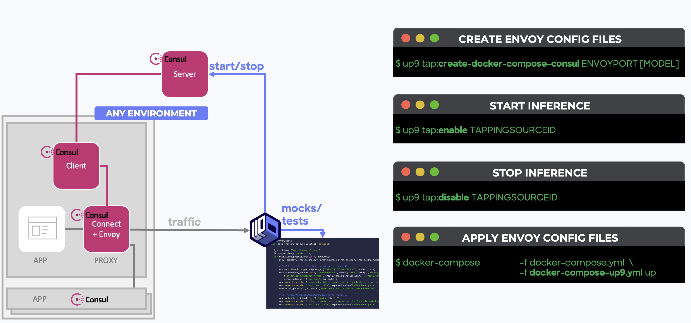
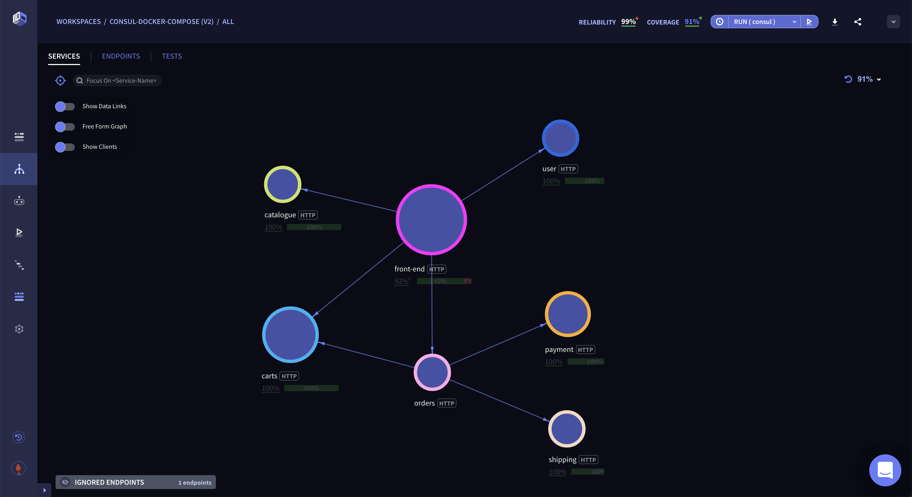
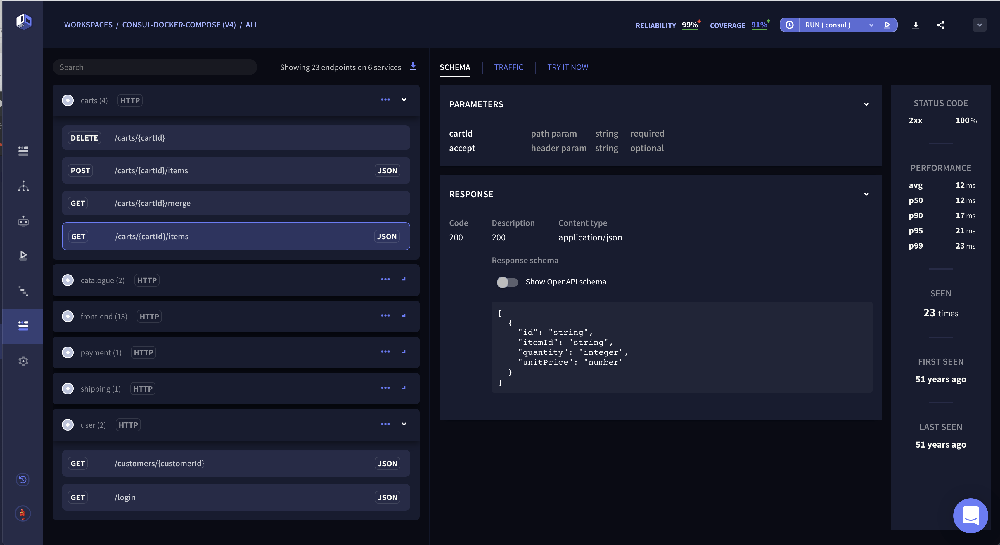
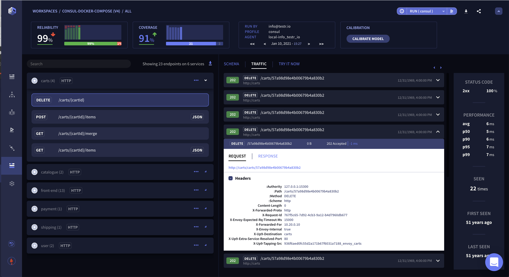
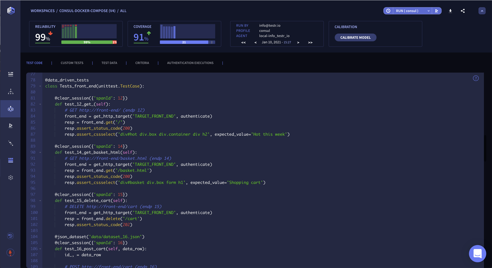
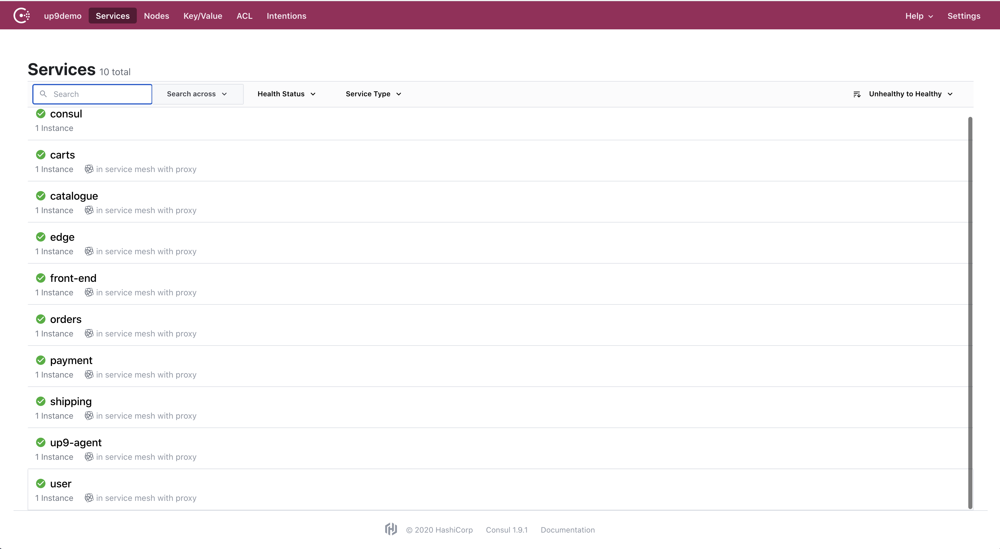

# Infer tests, mocks & observability from traffic with UP9, Consul & Docker-Compose

This repo demonstrates how to create traffic-inferred tests, contracts, mocks and observability that represent real-life application behavior. 

It includes:
* A demo microservice application ([WeaveSock](https://microservices-demo.github.io/docs/load-test.html))
* [Consul](https://github.com/hashicorp/consul) configuration files

## Requirements 
* An [UP9](https://up9.com/) account - If you don't have one already, you can sign up for free here: https://up9.app/signup
* UP9 CLI - `npm install -g up9`
* Docker-compose

## Steps

* Log in to your UP9 account on https://up9.com/.
* Authenticate your UP9 CLI - In your terminal window - `up9 auth:login`
* Create the nessesary Envoy configuration files: `up9 tap:create-docker-compose-consul 19001 <give-it-a-name>`
* Run `docker-compose -f docker-compose.yaml -f docker-compose-up9.yaml up`

## Using the apps

* Consul UI is available at http://localhost:8500
* Demo application is available at http://localhost:8000

## Architecture
UP9 uses Envoy configuration to subscribe and unsubsribe to traffic events. UP9 observes traffic and infer tests, contracts, mocks and observability.

A Consul Connect sidecar (with Envoy proxy) is attached to each service and is controlled by the Consul Server.  
Envoy proxies enforce mTLS communication by only authorized clients to enforce secure communication in the service mesh.

## Screenshots

